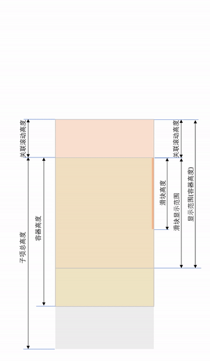

帖子页面用[RecyclerView-FastScroll](https://github.com/timusus/RecyclerView-FastScroll)来给`RecyclerView`加上快速滚动的滑块，同时，为了统一布局风格，标题用了`CollapsingToolbarLayout`，和`RecyclerView`有嵌套滑动。需要在关联滚动的同时保持滑块的位置，轮子并没有考虑到这个问题，那么魔改开始。

<!--more-->

先来看效果：


画个示意图：



首先，通过两个回调函数获取关联滚动的高度和关联滚动的距离

```kotlin
var nestedScrollRange = { 0 }    // 关联滚动的高度
var nestedScrollDistance = { 0 } // 关联滚动的距离
```

把关联滚动高度看作一个额外的子项，有：
$$
\begin{align}
总高度&=关联滚动高度+\sum子项高度\cr
滑块显示范围&=容器高度-上下边距-关联滚动高度\cr
滑块高度&=\max\left(\frac{容器高度\times 滚动距离}{总高度}, 最小滑块高度\right)\cr
可滚动距离&=总高度-容器高度+上下边距\cr
滑块移动范围&=滑块显示范围-滑块高度
\end{align}
$$

在`FastScrollRecyclerView.onUpdateScrollbar`里计算当前滑块位置：
$$
滑块位置=(关联滚动距离+子项滚动距离)\times\frac{滑块移动范围}{可滚动距离}+关联滚动距离+上边距
$$
由于多了嵌套滑动的距离，`touchFraction`就不能由`FastScroller`算出来，直接传滑块位置：

```diff
if (mIsDragging) {
    if (mLastY == 0 || Math.abs(mLastY - y) >= mTouchSlop) {
        mLastY = y;
        // Update the fastscroller section name at this touch position
-        boolean layoutManagerReversed = mRecyclerView.isLayoutManagerReversed();
-        int bottom = mRecyclerView.getHeight() - mThumbHeight;
-        float boundedY = (float) Math.max(0, Math.min(bottom, y - mTouchOffset));
-
-        // Represents the amount the thumb has scrolled divided by its total scroll range
-        float touchFraction = boundedY / bottom;
-        if (layoutManagerReversed) {
-            touchFraction = 1 - touchFraction;
-        }
-
-        String sectionName = mRecyclerView.scrollToPositionAtProgress(touchFraction);
+        String sectionName = mRecyclerView.scrollToPositionAtProgress(y - mTouchOffset);
        mPopup.setSectionName(sectionName);
        mPopup.animateVisibility(!sectionName.isEmpty());
        mRecyclerView.invalidate(mPopup.updateFastScrollerBounds(mRecyclerView, mThumbPosition.y));
    }
}
```

在`FastScrollRecyclerView.scrollToPositionAtProgress`里与当前滑块位置相减得滚动位移：

$$
滚动位移=(当前滑块位置-原滑块位置)\times\frac{可滚动距离}{滑块移动范围}
$$
然后模拟关联滚动：

```kotlin
startNestedScroll(ViewCompat.SCROLL_AXIS_VERTICAL)
val consumed = IntArray(2)
val offsetInWindow = IntArray(2)
dispatchNestedPreScroll(0, dy.roundToInt(), consumed, offsetInWindow)
dy -= consumed[1].toFloat()
val scrollY = Math.min(Math.max(scrolledPastHeight + dy, 0f), availableScrollHeight.toFloat())
dy -= scrollY - scrolledPastHeight
dispatchNestedScroll(
    consumed[0],
    consumed[1],
    0,
    Math.max(-nestedDistance + consumed[1], dy.roundToInt()),
    offsetInWindow
)
```

这里用`scrollY`先预测了`RecyclerView`所能消耗的滚动距离，再从高度缓存中找到对应的子项，调用`LayoutManager.scrollToPositionWithOffset`滚到对应位置，并返回其标题：

```kotlin
val layoutManager = layoutManager
val adapter = adapter
var totalOffset = 0
itemHeightCache.forEachIndexed { index, height ->
    if (scrollY >= totalOffset && scrollY <= totalOffset + height) {
        val wrapIndex = getAdapterItemIndex(index)
        if (layoutManager is LinearLayoutManager)
            layoutManager.scrollToPositionWithOffset(wrapIndex, totalOffset - scrollY.roundToInt())
        else if (adapter is MeasurableAdapter && layoutManager is StaggeredGridLayoutManager)
            layoutManager.scrollToPositionWithOffset(wrapIndex, totalOffset - scrollY.roundToInt())
        val sectionedAdapter = (adapter as? SectionedAdapter) ?: return ""
        return sectionedAdapter.getSectionName(wrapIndex)
    }
    totalOffset += height
}
return ""
```

[完整代码传送门](https://github.com/ekibun/Bangumi/blob/master/app/src/main/java/soko/ekibun/bangumi/ui/view/FastScrollRecyclerView.kt)