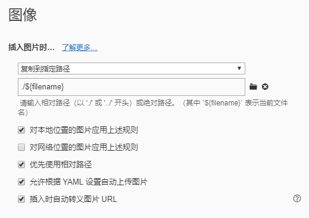

我习惯用Typora来写markdown，默认的hexo-asset-image和Typora的路径方法不太一样，看了一下源码也挺简单，就改成了和Typora相对路径一样的写法。

<!--more-->

#### Typora设置

可以设置插入图片时复制到文件名对应的文件夹：



#### hexo-asset-image修改

首先设置里的`post_asset_folder`要打开，然后在 `scripts`文件夹里新建`hexo-asset-image.js`文件：

```javascript
'use strict';
var cheerio = require('cheerio');

hexo.extend.filter.register('after_post_render', function(data){
  const { config } = hexo;
  if(config.post_asset_folder){
    const link = data.permalink.replace(new RegExp(`^${config.url}/|(index\.html)?$`, 'ig'), "");
    console.log(link);
    ['excerpt', 'more', 'content'].forEach((key) => {
      const $ = cheerio.load(data[key], {
        ignoreWhitespace: false,
        xmlMode: false,
        lowerCaseTags: false,
        decodeEntities: false
      });

      $('img').each(function(){
        ['src', 'data-src'].forEach((srcAttr) => {
          if(!$(this).attr(srcAttr)) return
          let src = $(this).attr(srcAttr).replace('\\', '/').trim();
          // skip http url
          if(/^(https?:)?\/\//.test(src)) return
          // replace ../ to config.root
          if(/^\.\.\//.test(src)) src = src.replace(/^\.\.\//, config.root);
          else {
            const srcArray = src.split('/').filter((elem) => elem && elem != '.');
            if(srcArray.length > 1) srcArray.shift();
            src = config.root + link + srcArray.join('/');
          }
          $(this).attr(srcAttr, src);
          console.info&&console.info(`update ${srcAttr} link to:${$(this).attr(srcAttr)}`);
        })
      });
      data[key] = $.html();
    });
  }
});
```

代码很简单，分成了三种情况：

- `http://`或者`//`开头的是完整的url地址，不用改
- `../`开头的会定位到上一级目录，也就是`source`文件夹，替换为`config.root`
- 其他的全认为是相对当前文件的地址，用帖子路径去替换和标题相同的第一个文件夹，

要注意的是如果开了`NexT`主题的`lazyload`，`content`里``的`src`会变成`data-src`，因此要同时检查`data-src`属性。