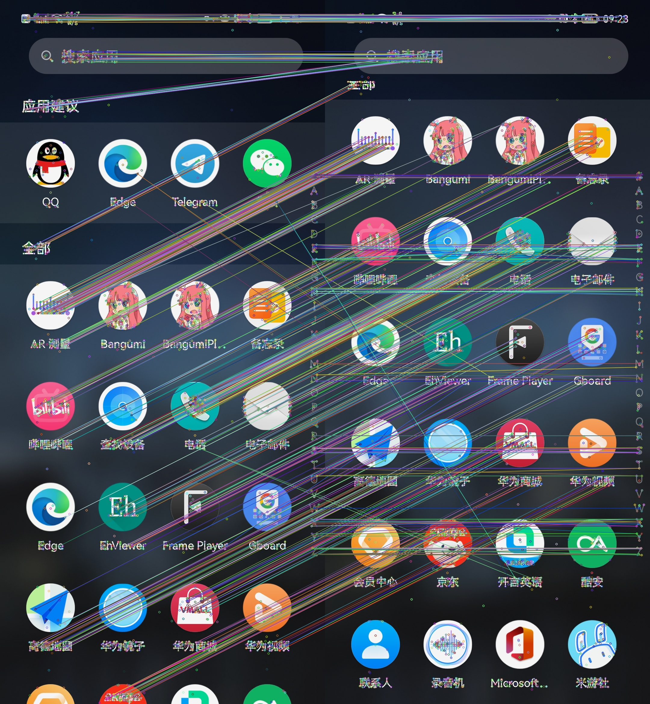
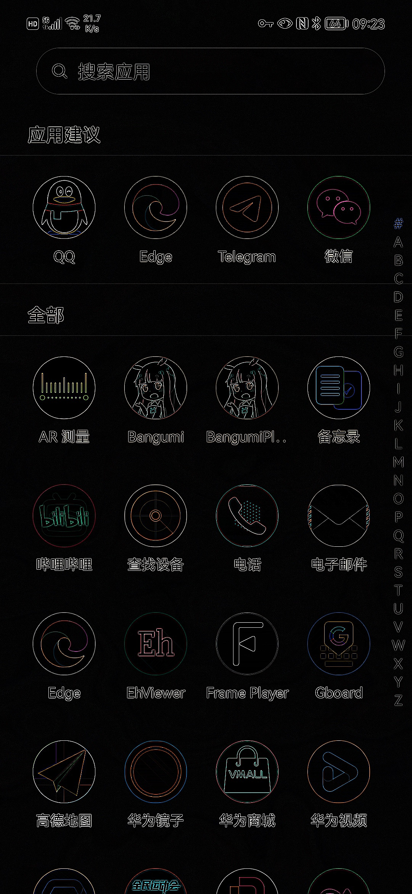
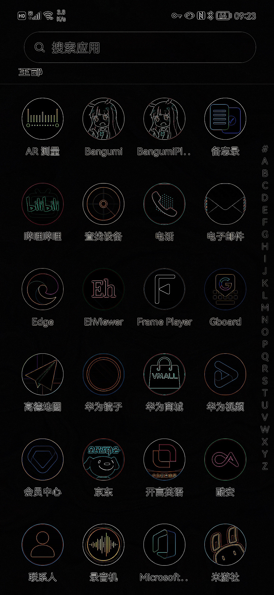
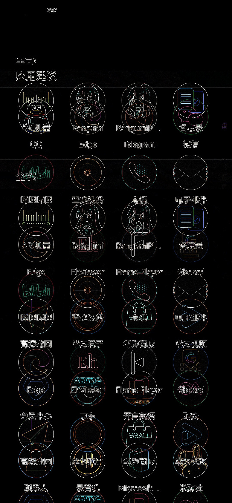
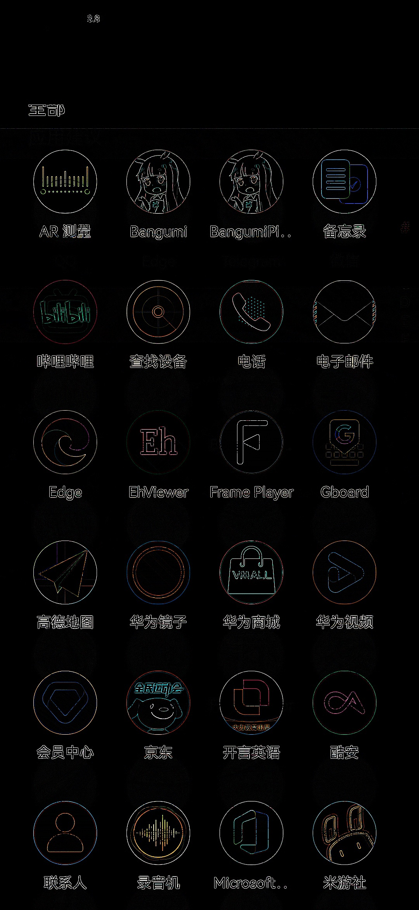

截图拼接的需求很多，四年前写的拼图软件出错概率太高，其他的同类软件也都不是很顺手，终于还是捡起了四年前的坑，加上了手动编辑，再也不用担心拼接出错了。为了实现拼地图，这次拼接算法用上了OpenCV，记录下摸索过程。

<!--more-->

#### Android 工程中导入 OpenCV

有两种方法，但都要下 [opencv-android-sdk.zip](https://github.com/opencv/opencv/releases)，解压出来放在程序目录，里面的`sdk`文件夹是一个gradle项目，可以直接里导入工程，然后就可以在java中调用函数了，也就是第一种方法，要注意的是，网传的`OpenCVLoader.initAsync`方法已被弃用，需要直接用`System.loadLibrary("opencv_java4")`或`OpenCVLoader.initDebug()`，`build.gradle`的注释上写的很详细。

第二种方法是采用jni静态编译，可以省点体积，`build.gradle`里同样有详细的说明，网上的方法都过时了，正确方法如下，主要是后面三行：

```
cmake_minimum_required(VERSION 3.6)

add_library(stitch SHARED stitch.cpp)

set(OpenCV_DIR ${CMAKE_CURRENT_LIST_DIR}/../../../../opencv/sdk/native/jni)
find_package(OpenCV REQUIRED)
target_link_libraries(stitch ${OpenCV_LIBS} jnigraphics)
```

#### 拼接算法

主要参考了[这篇博客](https://blog.csdn.net/hadkfhkdh/article/details/87972839)，考虑到截图中存在顶部和底部相同的问题，对算法做了一些调整，这里也记录一下。

首先直接对原图提取特征点会使得顶部和底部的相同区域出现很强匹配的关系：



首先提取两者的边界信息并做差 (`cv.absdiff`)，消除重合部分：


|   | - |  | = |  |
|  -- | -- | -- | -- | -- |

然后对两图取交 (`cv.bitwise_and`)：

|   | & |  | = |  |
|  -- | -- | -- | -- | -- |
|   | & |  | = |  |

看起来效果很不错，用它来提取特征点就能很好地消除重合部分：

