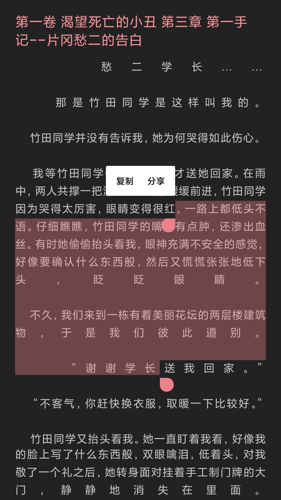

网上大部分的左右对齐都是基于重绘实现的，这样`TextView`自带的选择就不能用了。为了不自己来存`Layout`的信息，用`ReplacementSpan`来实现字间距的控制。

<!--more-->

效果长这样



一开始想直接修改`CharacterStyle`的`TextPaint.setLetterSpacing`来实现，但是**TextView在绘制Spanned的时候是逐个字符绘制的**，`LetterSpacing`在绘制的时候会被取整而对不齐。无奈之下选择用`ReplacementSpan`自己绘制：

```kotlin
class LetterSpacingSpan(private val width: Int, private val spacing: Float) : ReplacementSpan() {
    override fun getSize(paint: Paint, text: CharSequence?, start: Int, end: Int, fm: Paint.FontMetricsInt?): Int {
        return width
    }

    override fun draw(
        canvas: Canvas,
        text: CharSequence?,
        start: Int,
        end: Int,
        x: Float,
        top: Int,
        y: Int,
        bottom: Int,
        paint: Paint
    ) {
        paint.letterSpacing
        canvas.drawText(text ?: "", start, end, x + spacing, y.toFloat(), paint)
    }
}
```

为了保持选择区域，每个字符替换为一个`LetterSpacingSpan`，在分页的时候计算：

```kotlin
val pageWidth =
    recyclerView.width - referHolder.itemView.content_container.let { it.paddingLeft + it.paddingRight }
val titleHeight = if (page.index <= 1) referHolder.itemView.item_title.let {
    getEpTitle(page.ep).let { content ->
        StaticLayout.Builder.obtain(content, 0, content.length, it.paint, pageWidth)
            .setAlignment(Layout.Alignment.ALIGN_NORMAL)
            .setLineSpacing(it.lineSpacingExtra, it.lineSpacingMultiplier)
            .setIncludePad(it.includeFontPadding)
            .setUseLineSpacingFromFallbacks(it.isFallbackLineSpacing)
            .setBreakStrategy(it.breakStrategy)
            .setHyphenationFrequency(it.hyphenationFrequency)
            .setJustificationMode(it.justificationMode)
            .build()
    }.height + it.paddingBottom
} else 0
val layout = referHolder.itemView.item_content.let {
    StaticLayout.Builder.obtain(page.content, 0, page.content.length, it.paint, pageWidth)
        .setAlignment(Layout.Alignment.ALIGN_NORMAL)
        .setLineSpacing(it.lineSpacingExtra, it.lineSpacingMultiplier)
        .setIncludePad(it.includeFontPadding)
        .setUseLineSpacingFromFallbacks(it.isFallbackLineSpacing)
        .setBreakStrategy(it.breakStrategy)
        .setHyphenationFrequency(it.hyphenationFrequency)
        .setJustificationMode(it.justificationMode)
        .build()
}
val pageHeight =
    recyclerView.height - referHolder.itemView.content_container.let { it.paddingTop + it.paddingBottom }
var lastTextIndex = 0
var lastLineBottom = 0
var spannableStringBuilder = SpannableStringBuilder()
for (i in 0 until layout.lineCount) {
    val lineEnd = layout.getLineEnd(i)
    val lineStart = layout.getLineStart(i)
    val visibleEnd = layout.getLineVisibleEnd(i)
    spannableStringBuilder.append(SpannableString(page.content.substring(lineStart, lineEnd)).also {
        val textCount = visibleEnd - lineStart - 1
        if (textCount <= 1 || it.endsWith('\n') || i == layout.lineCount - 1) return@also
        if (widthArray.size < textCount) widthArray = FloatArray(textCount)
        val letterSpacing = (pageWidth - layout.getLineWidth(i)) / textCount / 2
        var width = layout.getPrimaryHorizontal(lineStart + 1) + letterSpacing
        it.setSpan(LetterSpacingSpan(width.toInt(), 0f), 0, 1, Spanned.SPAN_EXCLUSIVE_EXCLUSIVE)
        for (c in 1 until textCount) {
            val dw = layout.getPrimaryHorizontal(lineStart + c + 1) + (2 * c + 1) * letterSpacing
            it.setSpan(
                LetterSpacingSpan(dw.toInt() - width.toInt(), letterSpacing + (width % 1)),
                c,
                c + 1,
                Spanned.SPAN_EXCLUSIVE_EXCLUSIVE
            )
            width = dw
        }
        it.setSpan(
            LetterSpacingSpan(pageWidth - width.toInt(), letterSpacing + (width % 1)),
            textCount,
            textCount + 1,
            Spanned.SPAN_EXCLUSIVE_EXCLUSIVE
        )
    })
    val curLineBottom = layout.getLineBottom(i + 1) + titleHeight
    if (curLineBottom - lastLineBottom < pageHeight) continue
    ret += PageInfo(
        content = spannableStringBuilder.subSequence(
            0,
            spannableStringBuilder.length - lineEnd + visibleEnd
        ),
        ep = page.ep,
        rawInfo = page,
        rawRange = IntRange(lastTextIndex, visibleEnd)
    )
    lastTextIndex = lineEnd
    lastLineBottom = layout.getLineBottom(i) + titleHeight
    spannableStringBuilder = SpannableStringBuilder()
}
ret += PageInfo(
    content = spannableStringBuilder,
    ep = page.ep,
    rawInfo = page,
    rawRange = IntRange(lastTextIndex, page.content.length)
)
```

