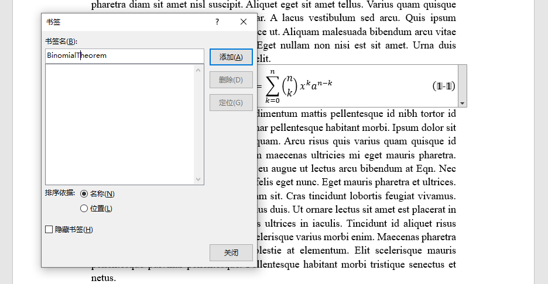

折腾毕业论文，Word的排版和自动编号比较奇特，浪费了很多时间，这里记录一下摸索的过程。

<!--more-->

### 图片截段

论文里有一堆大图，为了排版好看需要将图片都对齐到每页的顶部，然后在下方继续，这时图片就会将段落分成两半，可以将图片设为**上下型环绕**把文字挤下去：

摸索的时候发现图片总随着锚点乱跑，当大段大段删除的时候还会使得连续两页的图片跑到一起，需要把文本框的**允许重叠**和**随文字移动**的勾去掉：

以前插图名的时候是用的多级列表，但是多级列表没法给文本框编号，需要改成**题注**。采用题注还有一个好处是可以直接生成图表目录：

注：**上下型环绕**的格式无法占满一整页，至少会有一行文字，不知道怎么解决，以后再研究了...

### 公式编号

自word2016以来，自带的公式编辑器终于可以用`#`创建一个右对齐的编号位：

但是在**公式里不能插入题注**，需要**先插入题注**，再用`Alt+=`把题注套成公式：

但是这种方法在交叉引用的时候**不能直接选择题注**，否则会把整个公式全引用过去。要只显示公式编号，可以先选中编号插入书签：

然后在交叉引用中选择对应的书签：

### 公式字体

word自带的公式字体全是`Cambria Math`，要改变字体需要先把公式变成文本再选择字体，对于有编号的公式，全选转成文字会把编号右对齐的`#`也变成文本：

要只选择公式的那一部分，单独改成文本格式：

真是阴间的设计啊...